# blamazon

**Blamazon is an Amazon.com-like storefront demonstrating SQL skills.** I created this for the Coding Boot Camp at UNC-Chapel Hill in March 2019. The assignment called for very basic features which approximated retail business logic for customers, managers, and supervisors. I took the assignment further and created real business logic that could be extended to a true, funcioning retail site.**

# Features
In addition to the basic functions of [the assignment](homework_instructions.md), this app does the following:

### ADDITIONAL FEATURES:
* All item views allow line selection using arrow keys and `[return]`.
* Fully-functional shopping cart:
    * If guest has put items in his/her cart and then decides to create an account, the items are transferred to the new account's cart and removed from the guest cart.
    * Any items left in guest carts are cleared on Exit from the program.
    * Any items left in user carts are, of course, retained on Exit.
    * Items in user carts persist until user completes Checkout.
* Real user authentication. Passwords are not presently hashed but real user names and passwords are required and are checked against the database.
* Login and logout allow multiple users to access the site. This feature is reflected in the real world, but is especially valuable for testing/reviewing the use of this program.
* The assignment called for separate JavaScript files for user, manager, and adminstrator/supervisor. In my implementation, login and user authentication allow users with any privilege level (user, manager, administrator) to login *from the same prompt* to access their privilege-appropriate account.
* Administrator/supervisors can create user, manager, or administrator accounts.
* Guests can create a user account to keep their cart data from session-to-session, and in a future implementation to keep additional info like credit card and contact info.
* Managers and administrator/supervisors can optionally view the site at any privilege value below their own, allowing access and review of information from those other "points of view".
* Managers and adminstrators/supervisors can even add items to their cart and checkout when viewing the site as a user.
* Managers can easily adjust inventory levels from any item view.
* The assignment called for an "overhead_costs" field to mimic net profit calculations. In my implementation, I created realistic item costs in addition to the price-to-customer called for in the assignment. This allows real profit calculations on sales.
* Administator/supervisors can use `View Sales by Department` to display a table of sales data with details of each item (quantity sold, cost, retail price, and profit subtotals) and totals for each department.

### SCREENSHOTS:
01. `node blamazon` brings up the initial view:
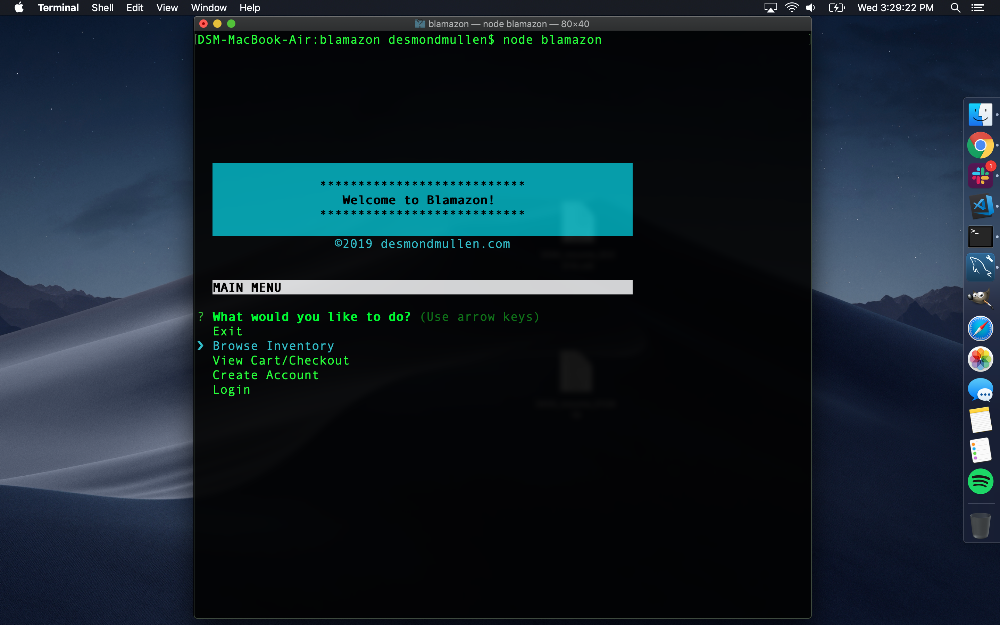
02. `Browse Inventory` shows the inventory in a selectable list:
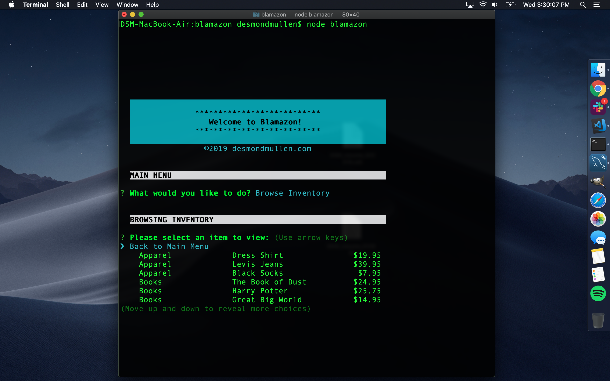
03. Using the arrow keys and `[return]` to select an item shows the item view:
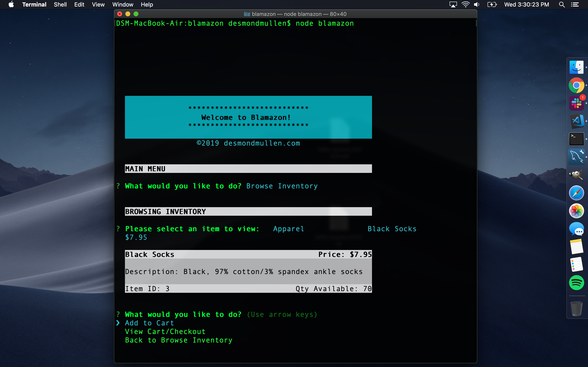
04. `Add to Cart` asks how many you would like and then adds them:
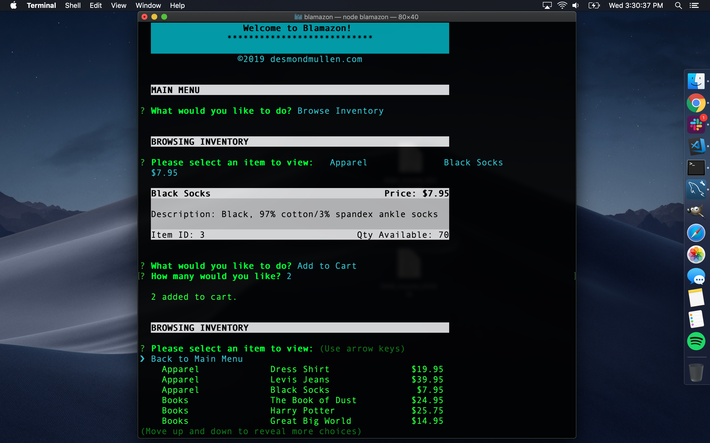
05. `View Cart/Checkout` shows the user's cart:
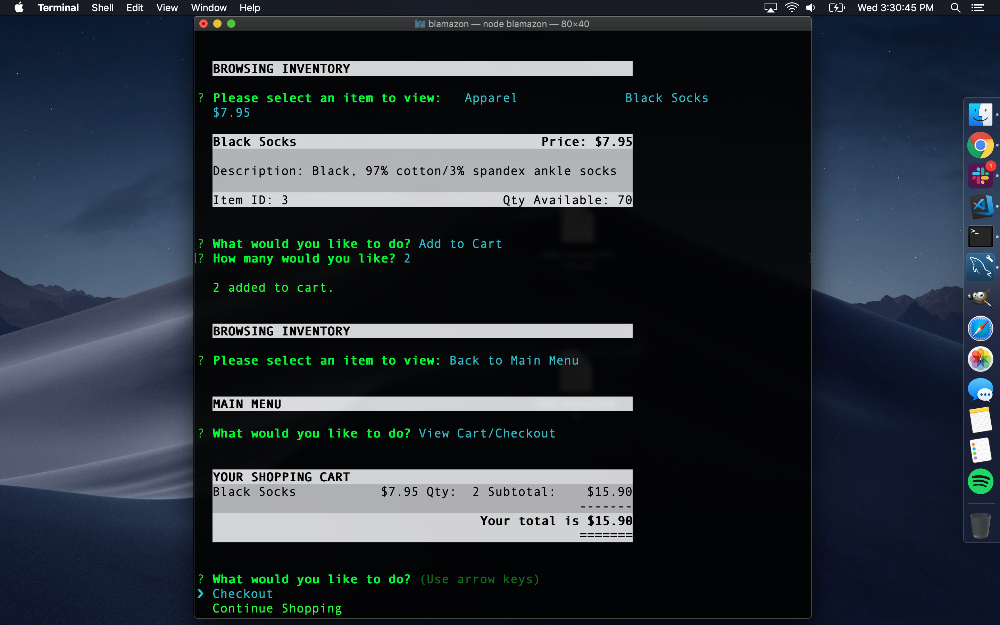
06. `Checkout` then prompts user to Submit Order or Continue Shopping:
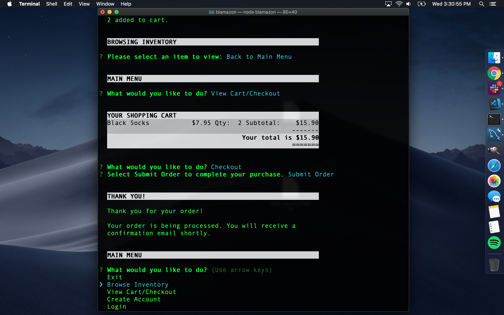
07. `Create Account` creates a user account. Shopping carts persist in user accounts whereas the guest cart is always cleared on Exit. When a guest creates an account, any items they had in their (guest) cart is transferred into their new user cart:

08. `Login` as manager. Login allows users, managers, and administrators alike to login to their accounts with privilege-appropriate access:
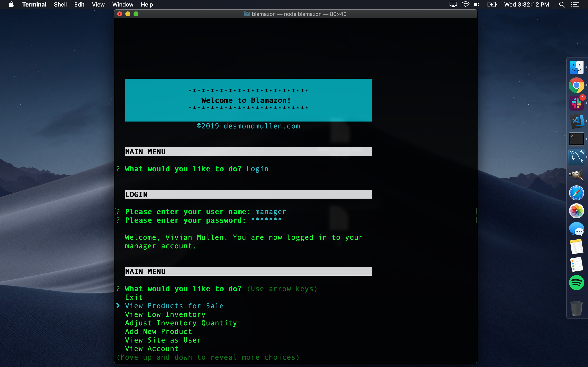
09. `View Products for Sale` in manager's view shows the inventory with quantities on hand:
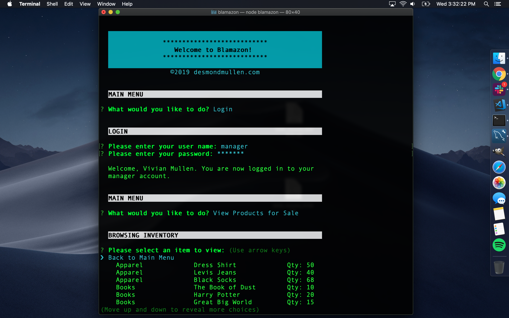
10. `View Low Inventory` in manager's view shows only inventory with quantities less than or equal to 10:
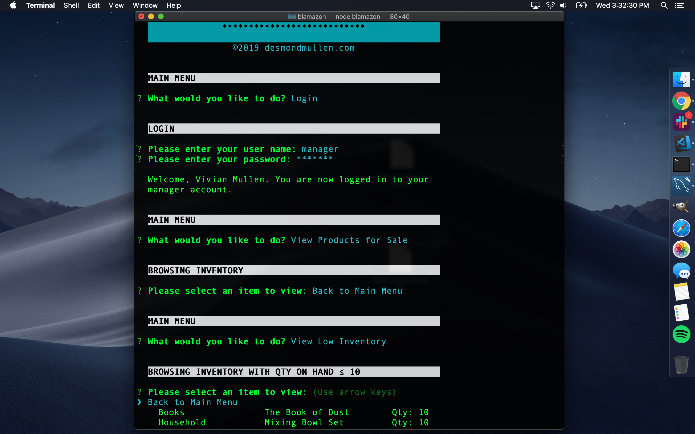
11. `Adjust Inventory Quantity` in manager's view shows the inventory with quantities on hand allowing manager to select which item to adjust. Inventory quantity can be adjusted in any item view when logged in as manager:
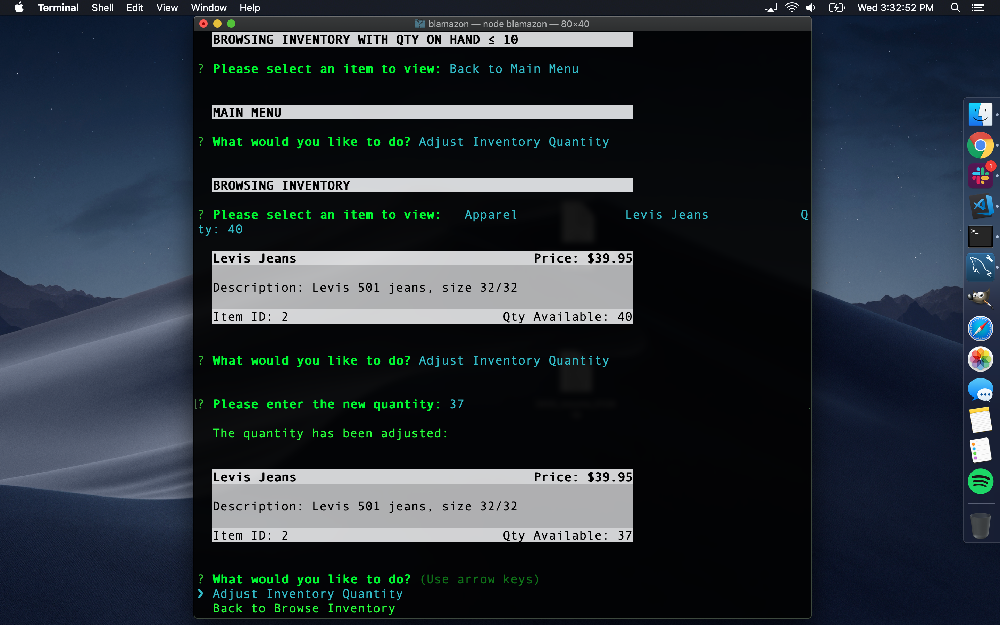
12. `Add New Product` in manager's view allows manager to add a new product:
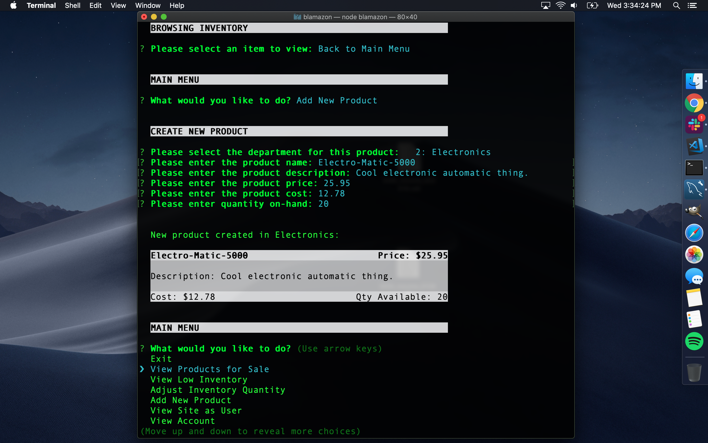
13. `Login` as administrator/supervisor. Login allows users, managers, and administrators alike to login to their accounts with privilege-appropriate access:
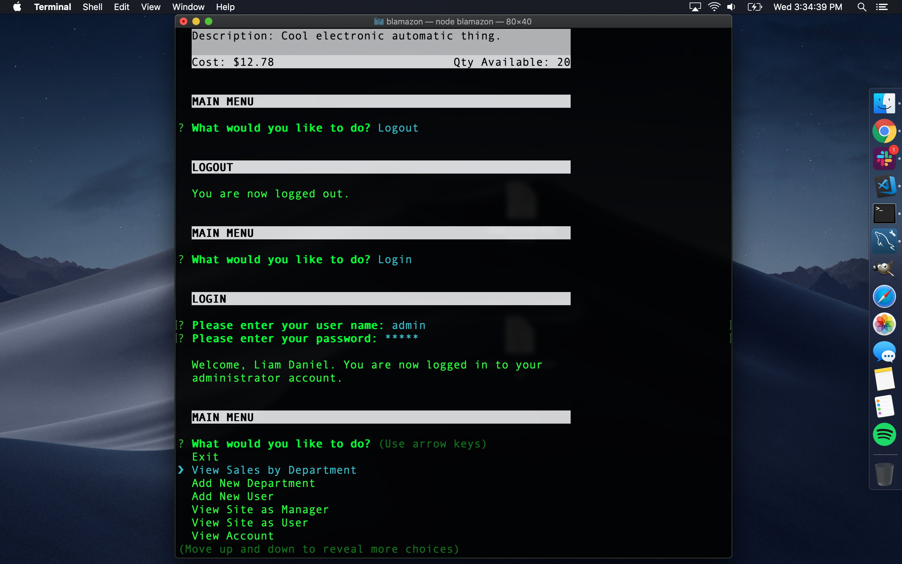
14. `View Sales by Department` in administrator/supervisor's view displays a table of sales data with details of each item and totals for each department:
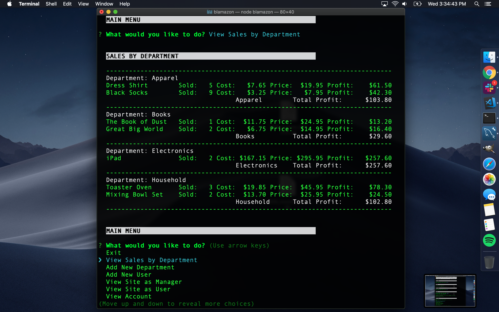
15. `Add New Department` in administrator/supervisor's view allows administrator/supervisor to add a new department:
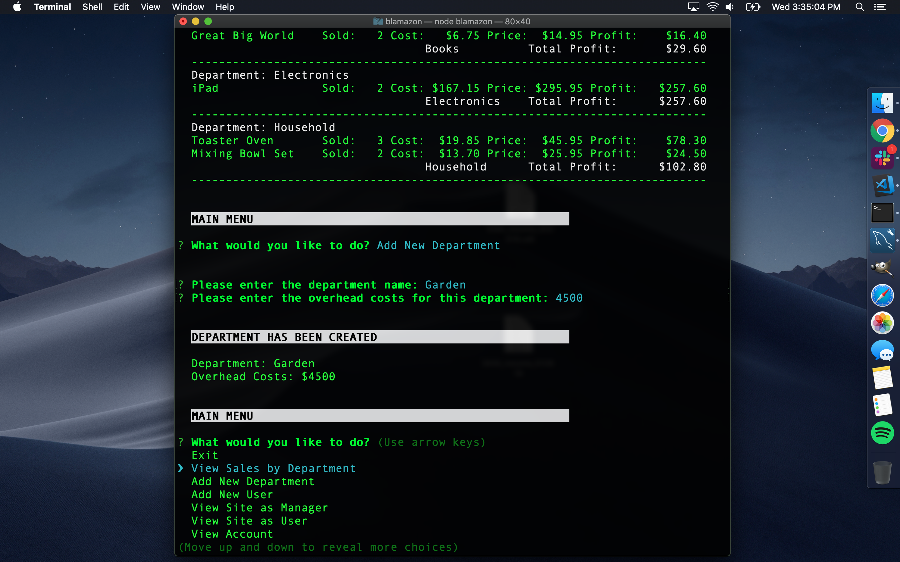
16. All inputs have basic error checking. Here is an example while administrator/supervisor is creating a new account:
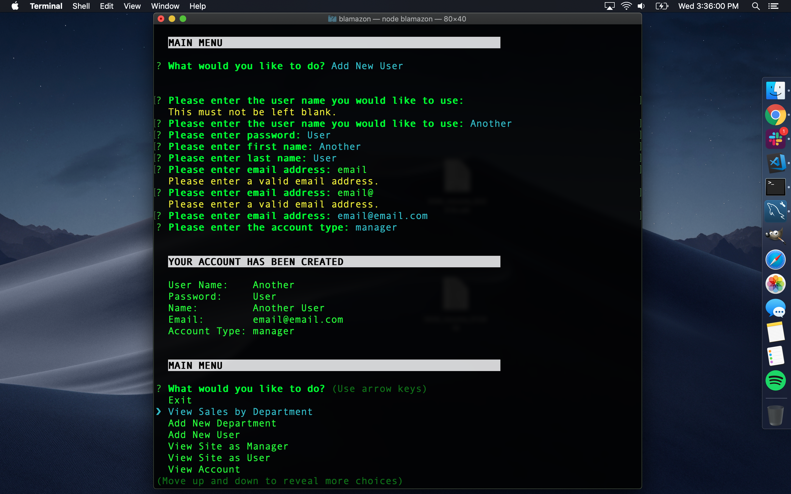
