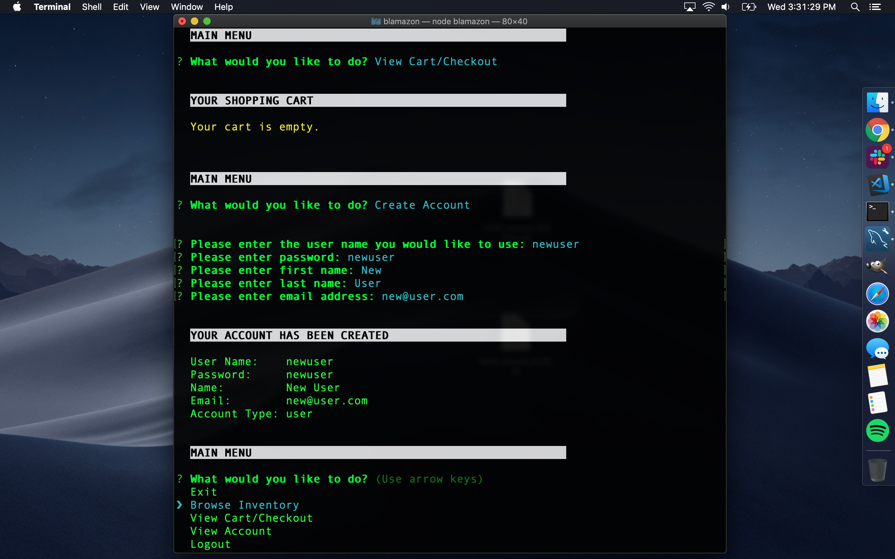

# blamazon

**Blamazon. copy copy copy**

# Features
In addition to the basic functions of... copy copy copy, this app does the following:

### ADDITIONAL FEATURES:
* copy copy copy
* If guest has put items in his/her cart and then decides to create an account, the items are transferred to the new account's cart and removed from the guest cart.
* Any items left in guest carts are cleared on Exit from the program.
* Any items left in user carts are, of course, retained on Exit.

### SCREENSHOTS:
01. `node blamazon` brings up the initial view:

02. `Browse Inventory` shows the inventory in a selectable list:

03. Using the arrow keys and `[return]` to select an item shows the item view:

04. `Add to Cart` asks how many you would like and then adds them:

05. `View Cart/Checkout` shows the user's cart:

06. `Checkout` then prompts user to Submit Order or Continue Shopping:

07. `Create Account` creates a user account. Shopping carts persist in user accounts whereas the guest cart is always cleared on Exit. When a guest creates an account, any items they had in their (guest) cart is transferred into their new user cart:

08. `Login` as manager. Login allows users, managers, and administrators alike to log in to their accounts with privilege-appropriate access:

09. `View Products for Sale` in manager's view shows the inventory with quantities on hand:

10. `View Low Inventory` in manager's view shows only inventory with quantities less than or equal to 10:

11. `Adjust Inventory Quantity` in manager's view shows the inventory with quantities on hand allowing manager to select which item to adjust. Inventory quantity can be adjusted in any item view when logged in as manager:

12. `Add New Product` in manager's view allows manager to add a new product:

13. `Login` as administrator/supervisor. Login allows users, managers, and administrators alike to log in to their accounts with privilege-appropriate access:

14. `View Sales by Department` in administrator/supervisor's view displays a table of sales data with details of each item and totals for each department:

15. `Add New Department` in administrator/supervisor's view allows administrator/supervisor to add a new department:

16. All inputs have basic error checking. Here is an example while administrator/supervisor is creating a new account:

